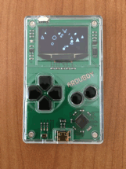

# Arduboy

Games and Demos for [Arduboy](http://arduboy.com) - a game system the size of a credit card, built on top of [Arduino](http://arduino.cc).

## Games and Demos

* [**Boids**](/boids)

  [Flocking behavior](https://en.wikipedia.org/wiki/Flocking_(behavior)) simulator, depicting flocking birds, shoaling fish or swarming bees. Done with as much of C++ and OOP as possible. Maybe too much :)

  
